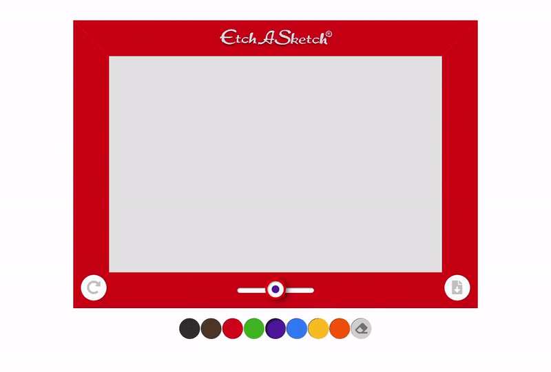

# Etch-a-Sketch (kinda)

---

PLAY HERE: [https://brandicameron.github.io/etchasketch/](https://brandicameron.github.io/etchasketch/)

---

## Description

This dude started out as a proper Etch-a-Sketch, I swear. But as the project developed, and the desire to add additional functionality over took me...it became “more”. So much more, that it’s not even really an Etch-a-Sketch anymore.

It still shakes though, and that’s fun. :D

---

## Things Learned:

- Canvas
- Touch Events
- Downloading an image of the canvas with canvas.toDataURL()
- How to make a custom styled range slider WITH FEEDBACK INDICATOR ON THE THUMB....that works in Chrome, Safari _AND_ Firefox. (had to be a little hacky to get it to function in Firefox)
- Where to put the aria-label on radio buttons for screen readers (hint: on the input, not the label)
- How to tab through radio buttons and how to use a range slider with the keyboard. (arrow keys!)
- How to make an animation run only on button click with GSAP

---

## Credits

Thanks to [William Malone](http://www.williammalone.com/articles/create-html5-canvas-javascript-drawing-app/) for his "Create a Drawing App with HTML5 Canvas and Javascript" article, it was just what I needed to get started.

--------------------------------

Thanks to [onyx1812](https://codepen.io/onyx1812/pen/GRJxmva?editors=0010) on CodePen for helping with the math to make the custom thumb follow the actual slider thumb.
